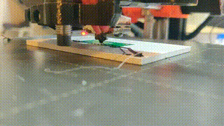
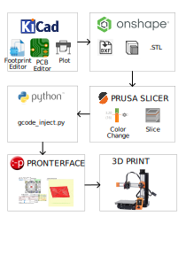
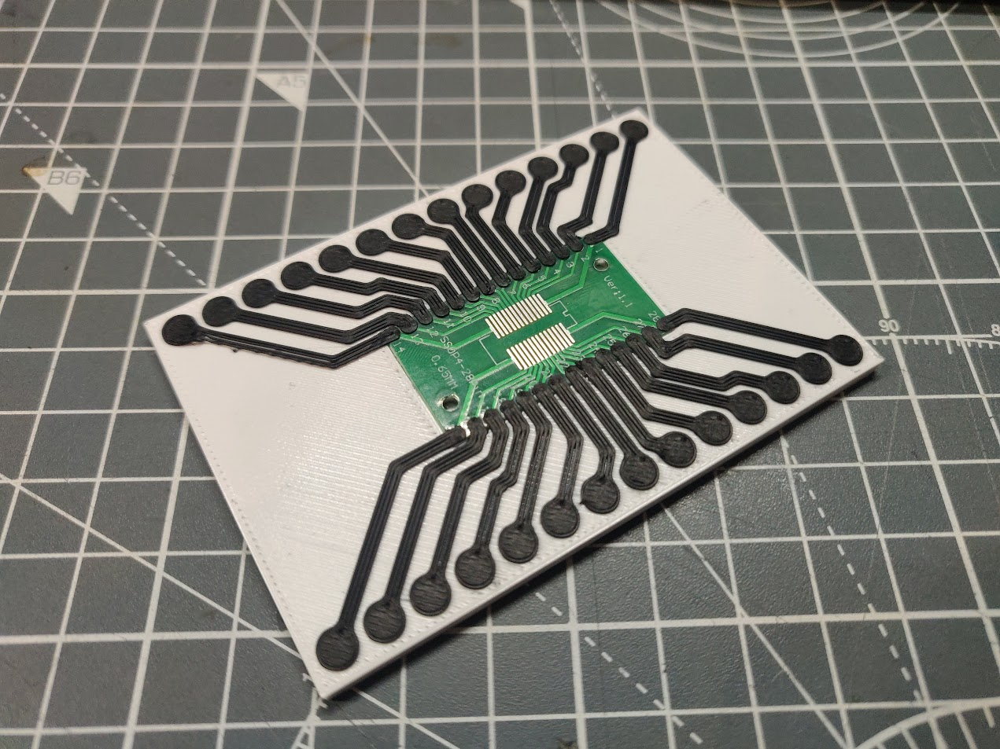

# SPLIC3R

> [!CAUTION]
> Unfinished project - things might not work

A toolflow for embedding functional PCBs into 3D prints with conductive traces

## Process
The main idea behind the process is to use tools that are already good at what they do for what they should be used for and efficiently bridge between those tools to create functional prototypes.

This project is in it's early stages, and as it develops the plan is to wrap many of the manual processes up with scripts, but still allow a user to easily access intermediary files in order to develop their own process flows for device prototyping

PCBs are designed in KiCad to then load them into a 3D modelling software, to then be sliced by a 3D Printer slicer, to finally have extra g-code added by a custom script that had the necessary information to inject conductive filament into the plated though holes of a PCB.

